# 🏥 Hospital Management System

Welcome to the Hospital Management System project! This project is built using Java, JSP, Servlets, JDBC, and MySQL. It aims to streamline and manage hospital operations efficiently.

## 📋 Table of Contents
- [Introduction](#introduction)
- [Features](#features)
- [Installation](#installation)
- [Running the Project](#running-the-project)
- [Screenshots](#screenshots)
- [Contributing](#contributing)
- [Contact](#contact)

## 📝 Introduction
The Hospital Management System is designed to manage the administrative tasks of hospitals, including patient records, doctor appointments, and billing. 

## ✨ Features
- Manage patient records
- Schedule and track doctor appointments
- Generate billing
- User authentication and authorization

## 🚀 Installation

### Prerequisites
Ensure you have the following installed:
- Java Development Kit (JDK)
- Apache Tomcat
- MySQL
- Eclipse IDE
- Proper JAR files for JDBC and Servlet APIs

### Steps to Install
1. **Clone the Repository:**
   ```bash
   git clone https://github.com/Shripad735/hospital-management-system.git
   ```
2. **Import Project in Eclipse:**
   - Open Eclipse
   - File -> Import -> Existing Projects into Workspace -> Select the cloned repository

3. **Configure Database:**
   - Create a database in MySQL using the provided `sql.txt` file.
   - Update the database credentials in the project:
     ```java
     //
     String url = "jdbc:mysql://localhost:3306/hospitalmngsys";
     String username = "your_username";
     String password = "your_password";
     ```

4. **Add Libraries:**
   - Ensure all required JAR files are added to your project’s build path.

## ▶️ Running the Project
1. **Start Apache Tomcat in Eclipse:**
   - Add and configure your project on Tomcat.
   - Start the Tomcat server.

2. **Access the Application:**
   - Open your browser and go to: `http://localhost:8080/hospital-management-system/homepage.jsp`

## 📸 Screenshots
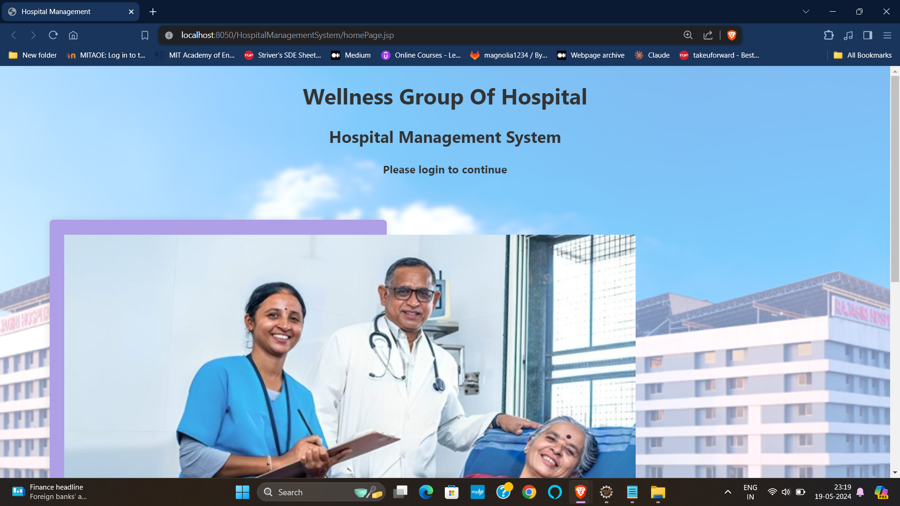
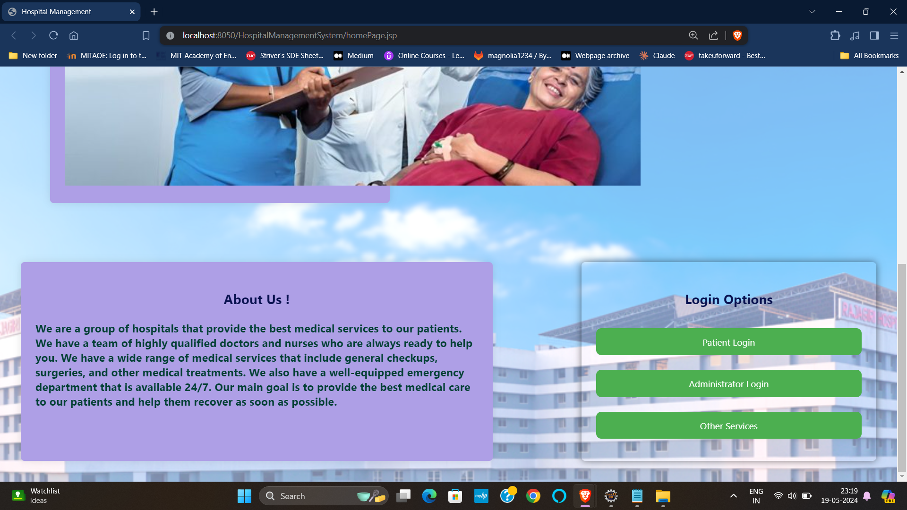
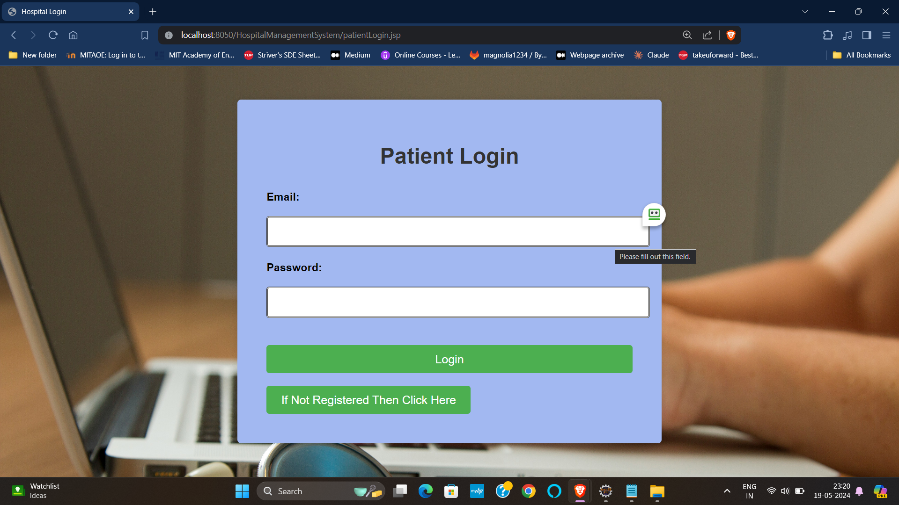
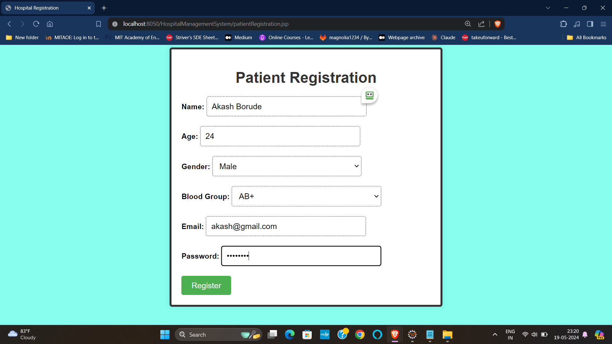
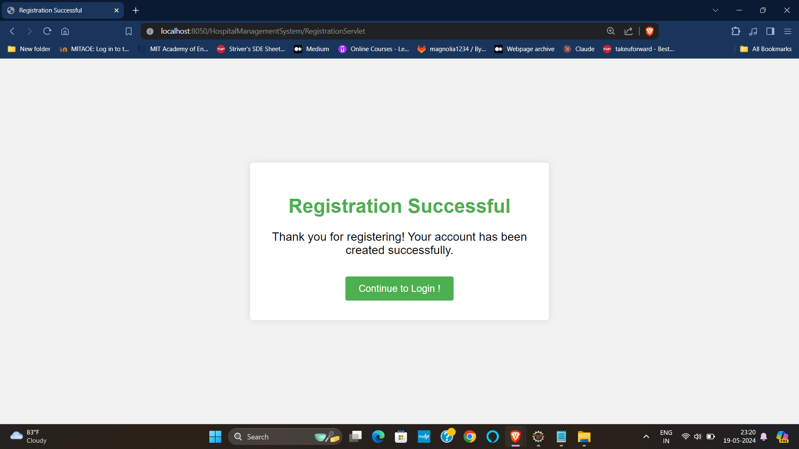
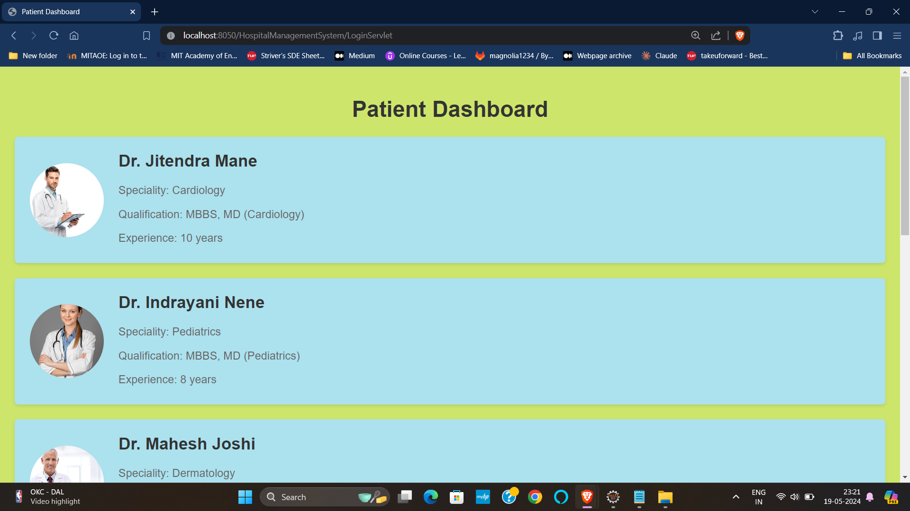
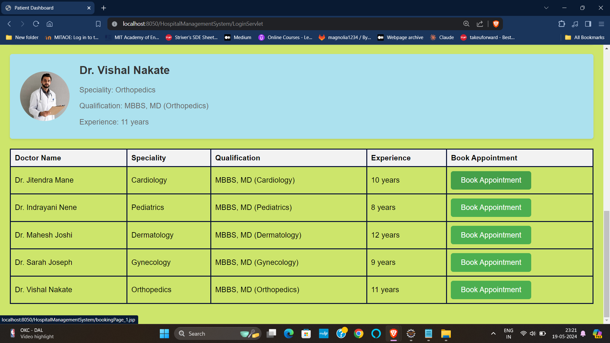
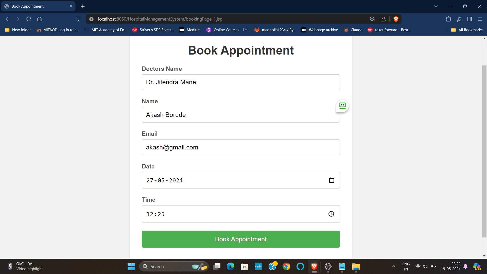
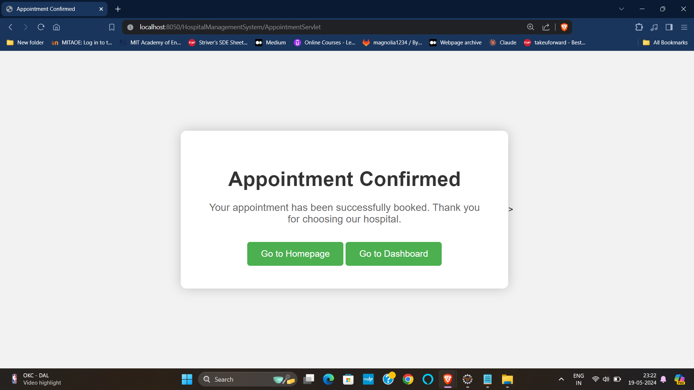
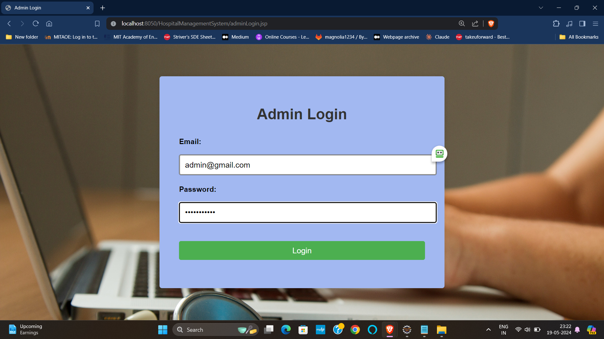
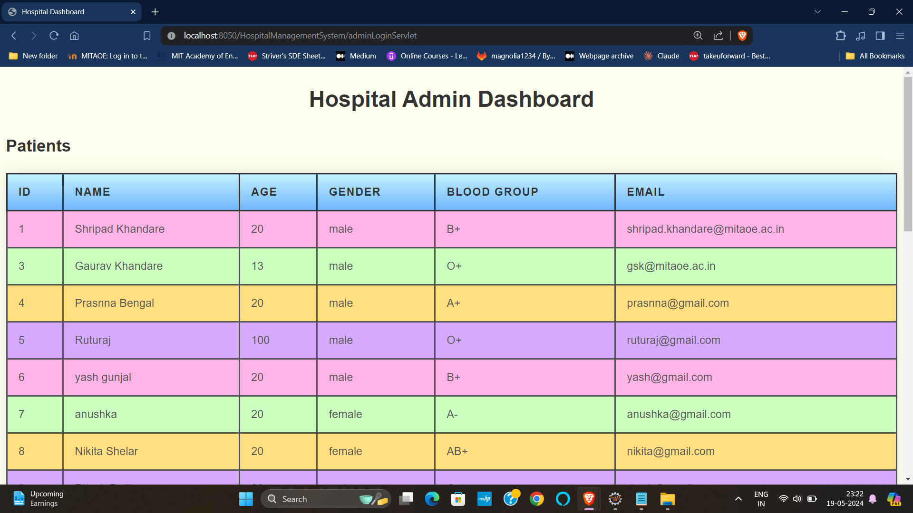
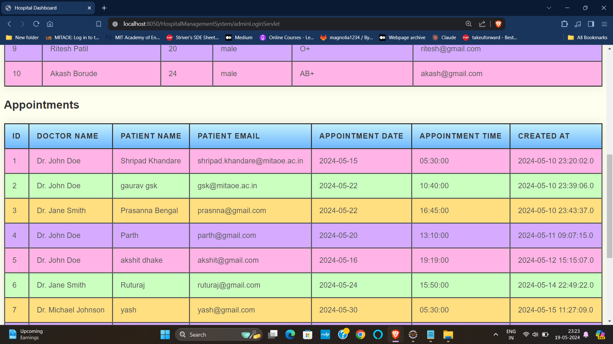
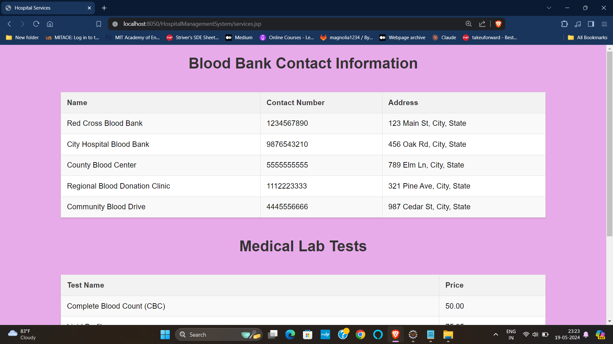
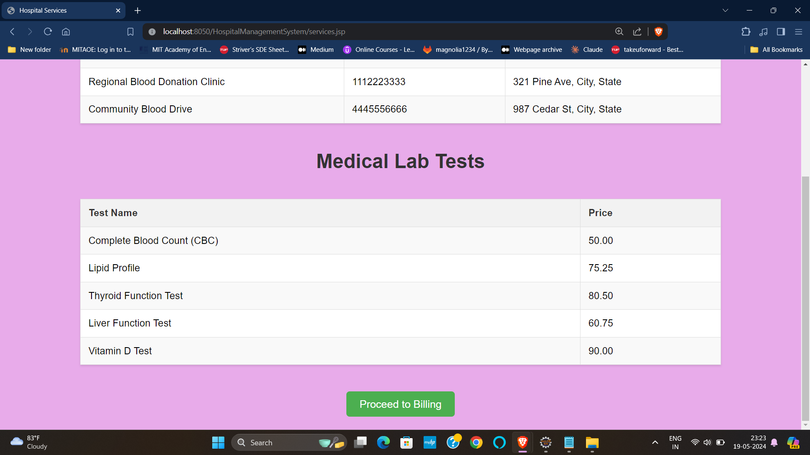
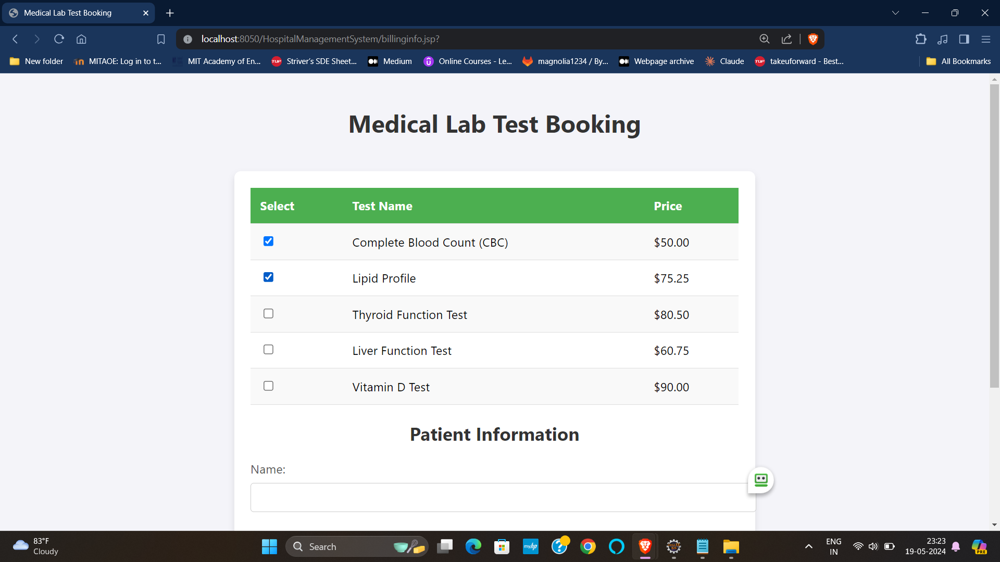
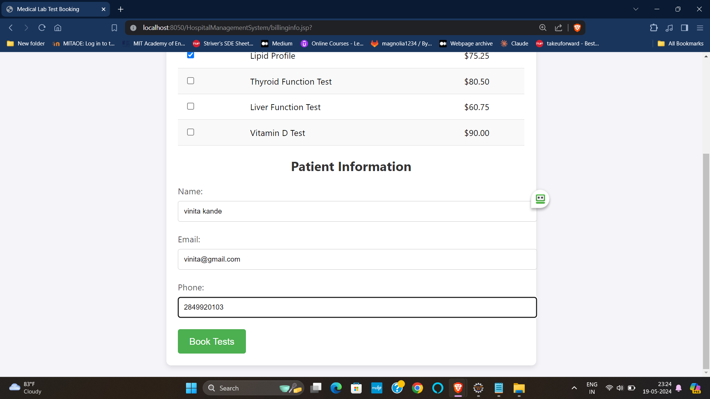


## 🤝 Contributing
I welcome all contributions! Here’s how you can help:

1. **Fork the repository**
2. **Create a new branch**
   ```bash
   git checkout -b feature/your-feature
   ```
3. **Commit your changes**
   ```bash
   git commit -m "Add your message here"
   ```
4. **Push to the branch**
   ```bash
   git push origin feature/your-feature
   ```
5. **Create a Pull Request**

For major changes, please open an issue first to discuss what you would like to change.

## 📞 Contact
If you have any questions or suggestions, feel free to contact me at:
- Email: shripadgaurav444@gmail.com
- LinkedIn: [My LinkedIn](www.linkedin.com/in/shripad-khandare-39a2a2203)

Thank you for checking out the Hospital Management System project! 🙌
```
